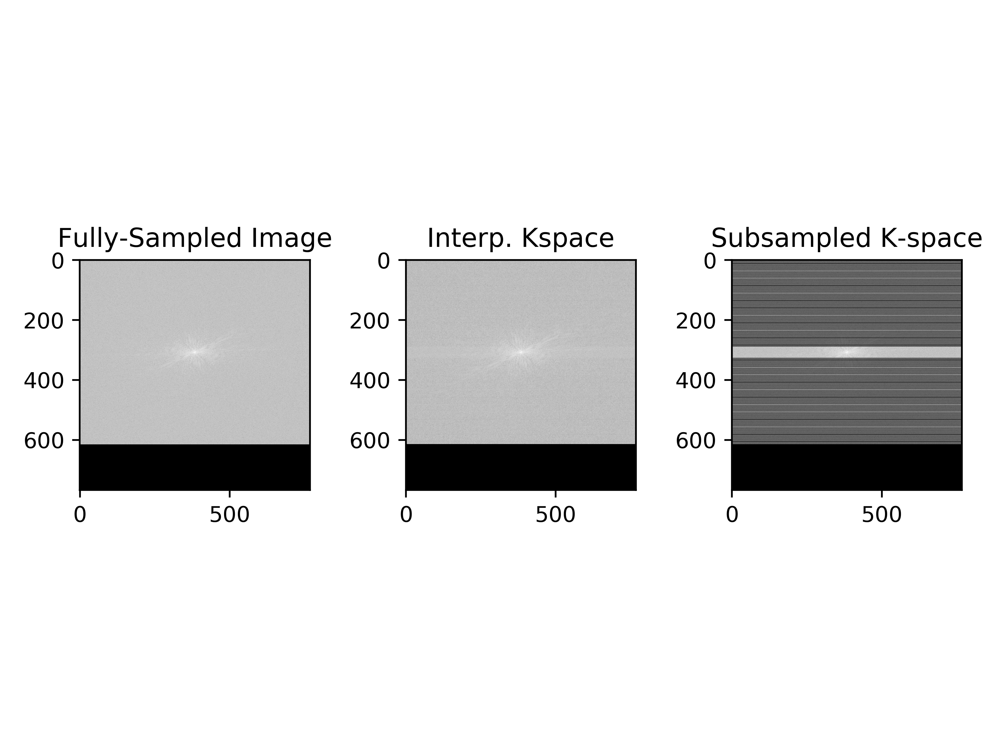
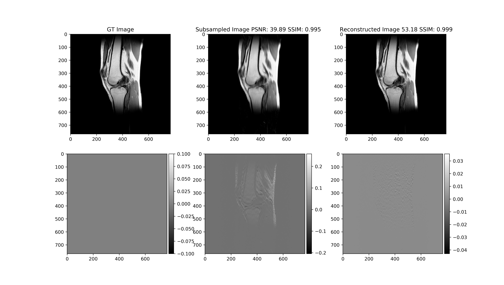

# DeepMRI

Pytorch implementation of RAKI paper with mild changes and optimizations [1]

## Getting Started

Clone the Repo:  
```bash
git clone https://github.com/geopi1/DeepMRI.git
```

### Datasets
Download the Datasets:

[link to mridata](http://mridata.org/list)

In this site select any of the available MRI scans and download to a folder
    
* An auto download script will be added soon

### Prerequisites
1. Setup conda 
    ```bash
    conda env create -f env.yml
    ```
    This will create a working environment named DeepMRI
2. Setup can also be performed with pip (virtual env) via the requirements.txt file 
    ```bash
    python3 -m venv DeepMRI
    pip install -r requirements.txt
    ```
3. Run save_raw_data_to_pickle.py to save the .h5 files from mridata.org as a pickle with np matrices
    ```bash
    python save_raw_data_to_pickle.py -p [path_to_wanted_folder]
    ```
    or
    ```bash
    python save_raw_data_to_pickle.py --data_path [path_to_wanted_folder]
    ```

## Running Tests
### Code
All the hyperparameters of the code are saved as .json in config.json.
Please look at the number of epochs.

To run the code, activate the conda environment
```bash
conda activate DeepMRI
```
or select the appropriate python interpreter path and run: 
```bash
python main.py
```
### Logs
Each run records the training process, saving the learing_rate (lr) and the loss.
To view these live via tensorboard:
* Navigate to the appropriate folder
* Open command line or terminal
* from the proper conda env (or it tensorboard is in path) type:
```bash
tensorboard --logdir logs_dir/
```

## Results




## License

This project is licensed under the MIT License - see the [LICENSE.md](LICENSE.md) file for details

## Acknowledgments
[1] Akçakaya, Mehmet et al. “Scan-specific robust artificial-neural-networks for k-space interpolation (RAKI) reconstruction: Database-free deep learning for fast imaging.” Magnetic resonance in medicine vol. 81,1 (2019): 439-453. doi:10.1002/mrm.27420

[2] mridata.org
